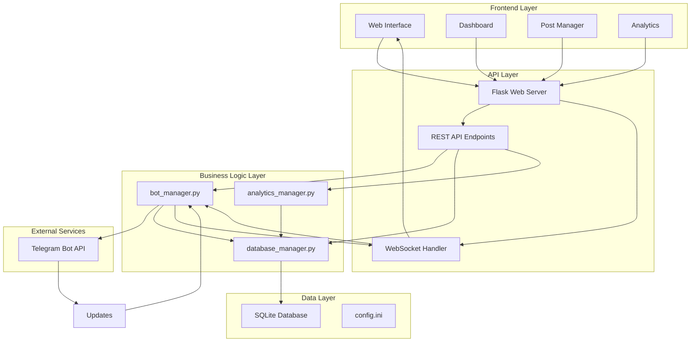
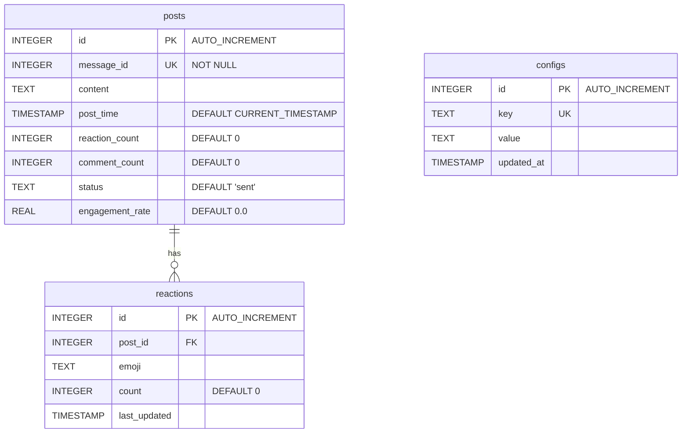
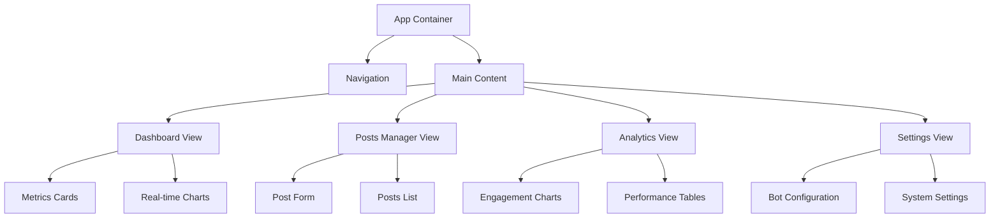
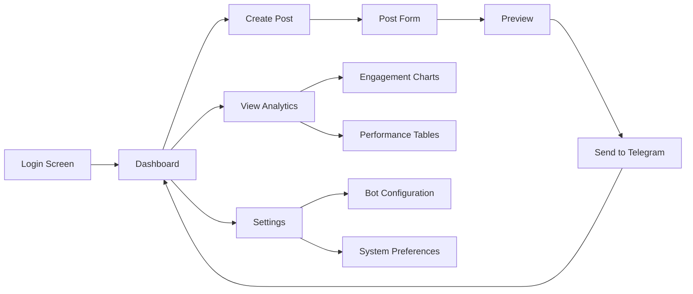
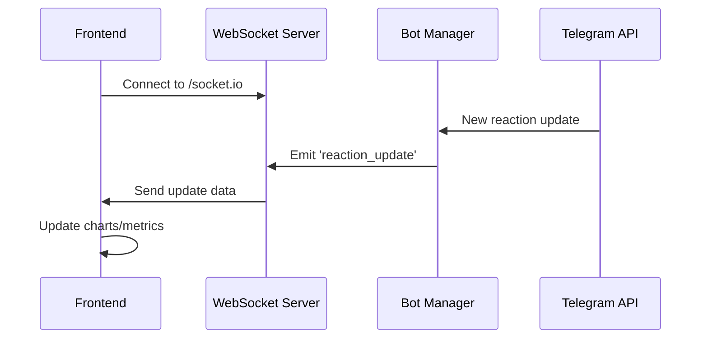
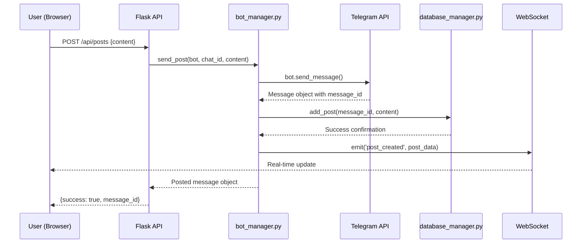
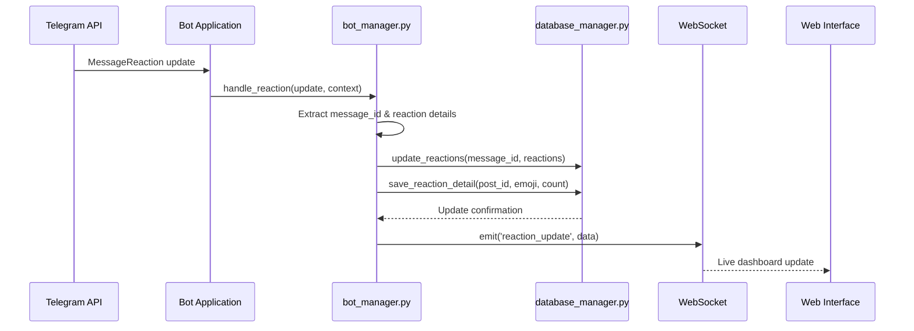
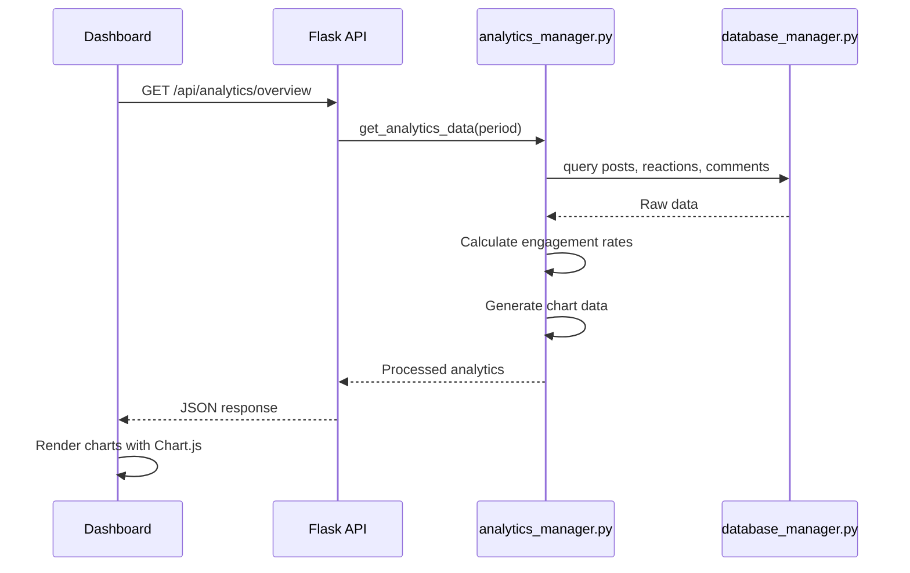
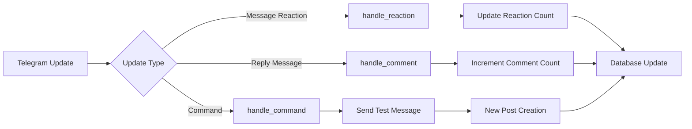

# Sistema de Automação de Postagens no Telegram

## Overview

Sistema web full-stack para automatizar postagens em grupos/canais do Telegram com monitoramento avançado de engajamento. O sistema oferece uma interface web elegante para gerenciar postagens, visualizar métricas em tempo real, e analisar dados de engajamento através de dashboards interativos.

### Objetivos Principais
- Interface web moderna para gerenciar postagens no Telegram
- Dashboard em tempo real com métricas de engajamento
- Automatizar postagens de conteúdo em grupos/canais do Telegram
- Monitorar e registrar reações (👍, ❤️, etc.) em tempo real
- Rastrear comentários e respostas aos posts
- Persistir dados de engajamento em SQLite
- Visualização de dados com gráficos e estatísticas

## Technology Stack & Dependencies

### Frontend Technologies
- **HTML5/CSS3/JavaScript**: Interface web nativa
- **Chart.js**: Visualização de dados e gráficos
- **Bootstrap 5**: Framework CSS para design responsivo
- **WebSocket**: Comunicação em tempo real para atualizações
- **Fetch API**: Requisições AJAX para backend

### Backend Technologies
- **Python 3.8+**: Linguagem principal do backend
- **Flask**: Framework web para APIs REST
- **Flask-SocketIO**: WebSocket para atualizações em tempo real
- **python-telegram-bot 20.7+**: SDK oficial para Telegram Bot API
- **SQLite**: Banco de dados local para persistência
- **ConfigParser**: Gerenciamento de configurações
- **Asyncio**: Programação assíncrona para handlers

### Dependencies (requirements.txt)
```
python-telegram-bot==20.7
flask==2.3.3
flask-socketio==5.3.6
flask-cors==4.0.0
python-dotenv
```

## Architecture

### System Architecture



### Component Architecture

#### Frontend Components

##### 1. Web Interface (index.html)
- **Responsabilidade**: Interface principal do usuário
- **Funcionalidades**:
  - Formulário para criar novas postagens
  - Lista de postagens recentes
  - Controles de configuração do bot

##### 2. Dashboard (dashboard.html)
- **Responsabilidade**: Visualização de métricas
- **Funcionalidades**:
  - Gráficos de engajamento em tempo real
  - Estatísticas de reações e comentários
  - Histórico de performance dos posts

##### 3. Analytics Module (analytics.js)
- **Responsabilidade**: Processamento de dados no frontend
- **Funcionalidades**:
  - Renderização de gráficos com Chart.js
  - Atualizações em tempo real via WebSocket
  - Filtros e ordenação de dados

#### Backend Components

##### 1. Flask Web Server (app.py)
- **Responsabilidade**: Servidor web principal
- **Funcionalidades**:
  - Servir arquivos estáticos (HTML, CSS, JS)
  - Gerenciar rotas da API REST
  - Coordenação entre bot e interface web

##### 2. API Endpoints (api_routes.py)
- **Responsabilidade**: Interface REST para o frontend
- **Funcionalidades**:
  - POST /api/posts - Criar nova postagem
  - GET /api/posts - Listar postagens
  - GET /api/analytics - Dados para dashboard
  - PUT /api/config - Atualizar configurações

##### 3. Bot Manager (bot_manager.py)
- **Responsabilidade**: Lógica de interação com Telegram API
- **Funcionalidades**:
  - Envio de mensagens
  - Processamento de atualizações
  - Handlers para reações e comentários

##### 4. Database Manager (database_manager.py)
- **Responsabilidade**: Persistência e recuperação de dados
- **Funcionalidades**:
  - Criação e manutenção do schema
  - CRUD operations para posts
  - Atualizações de métricas de engajamento

##### 5. Analytics Manager (analytics_manager.py)
- **Responsabilidade**: Processamento de métricas e relatórios
- **Funcionalidades**:
  - Cálculos de engagement rate
  - Agregação de dados por período
  - Geração de insights automatizados

## Data Models & ORM Mapping

### Database Schema



### Table Definitions

#### Posts Table
```sql
CREATE TABLE posts (
    id INTEGER PRIMARY KEY AUTOINCREMENT,
    message_id INTEGER UNIQUE NOT NULL,
    content TEXT,
    post_time TIMESTAMP DEFAULT CURRENT_TIMESTAMP,
    reaction_count INTEGER DEFAULT 0,
    comment_count INTEGER DEFAULT 0,
    status TEXT DEFAULT 'sent',
    engagement_rate REAL DEFAULT 0.0
);
```

#### Reactions Table
```sql
CREATE TABLE reactions (
    id INTEGER PRIMARY KEY AUTOINCREMENT,
    post_id INTEGER,
    emoji TEXT,
    count INTEGER DEFAULT 0,
    last_updated TIMESTAMP DEFAULT CURRENT_TIMESTAMP,
    FOREIGN KEY (post_id) REFERENCES posts (id)
);
```

#### Configs Table
```sql
CREATE TABLE configs (
    id INTEGER PRIMARY KEY AUTOINCREMENT,
    key TEXT UNIQUE,
    value TEXT,
    updated_at TIMESTAMP DEFAULT CURRENT_TIMESTAMP
);
```

### Data Model Operations

| Operation | Method | Description |
|-----------|--------|-------------|
| Create | `add_post(message_id, content)` | Registra novo post |
| Update | `update_reactions(message_id, count)` | Atualiza contagem de reações |
| Update | `increment_comment_count(message_id)` | Incrementa comentários |
| Read | `get_post_stats(message_id)` | Recupera estatísticas |
| Read | `get_analytics_data(period)` | Dados para dashboard |
| Create | `save_reaction_detail(post_id, emoji, count)` | Salva detalhes de reação |
| Update | `update_config(key, value)` | Atualiza configurações |

## Frontend Architecture

### Component Hierarchy



### State Management

#### Frontend State Structure
```javascript
const appState = {
    posts: [],
    analytics: {
        totalPosts: 0,
        totalReactions: 0,
        totalComments: 0,
        engagementRate: 0.0
    },
    config: {
        botToken: '',
        chatId: '',
        autoRefresh: true
    },
    ui: {
        currentView: 'dashboard',
        loading: false,
        errors: []
    }
};
```

### Styling Strategy & User Experience

#### Design System
- **Framework**: Bootstrap 5 para responsividade
- **Color Palette**: 
  - Primary: #0088cc (Telegram Blue)
  - Success: #28a745 (Green for successful posts)
  - Warning: #ffc107 (Yellow for pending actions)
  - Danger: #dc3545 (Red for errors)
- **Typography**: System fonts com fallback para Arial
- **Icons**: Font Awesome para ícones de interface

#### User Interface Flow



#### Responsive Design
- **Desktop**: Layout completo com sidebar de navegação
- **Tablet**: Menu collapseável, gráficos adaptados
- **Mobile**: Interface simplificada, touch-friendly
- **Breakpoints**: 576px, 768px, 992px, 1200px

#### Real-time Features
- **Live Notifications**: Toast messages para novos eventos
- **Auto-refresh Indicators**: Loading spinners e progress bars
- **Connection Status**: Indicador visual do status da conexão
- **Data Synchronization**: Sync automático entre abas abertas



## API Endpoints Reference

### REST API Specification

#### Posts Management

| Method | Endpoint | Description | Request Body | Response |
|--------|----------|-------------|--------------|----------|
| GET | `/api/posts` | Lista todas as postagens | - | `{posts: []}` |
| POST | `/api/posts` | Cria nova postagem | `{content: string}` | `{success: bool, message_id: int}` |
| GET | `/api/posts/{id}` | Detalhes de uma postagem | - | `{post: {}, reactions: []}` |
| DELETE | `/api/posts/{id}` | Remove postagem | - | `{success: bool}` |

#### Analytics Endpoints

| Method | Endpoint | Description | Parameters | Response |
|--------|----------|-------------|------------|----------|
| GET | `/api/analytics/overview` | Métricas gerais | `period=7d` | `{metrics: {}}` |
| GET | `/api/analytics/engagement` | Taxa de engajamento | `period=30d` | `{chart_data: []}` |
| GET | `/api/analytics/reactions` | Detalhes de reações | `post_id=int` | `{reactions: []}` |

#### Configuration Endpoints

| Method | Endpoint | Description | Request Body | Response |
|--------|----------|-------------|--------------|----------|
| GET | `/api/config` | Configurações atuais | - | `{config: {}}` |
| PUT | `/api/config` | Atualiza configurações | `{key: value}` | `{success: bool}` |
| POST | `/api/config/test` | Testa conexão do bot | - | `{valid: bool, error?: string}` |

### Request/Response Schema

#### Post Creation Request
```json
{
  "content": "Texto da mensagem para postar",
  "schedule_time": "2024-01-01T10:00:00Z" // opcional
}
```

#### Analytics Response
```json
{
  "metrics": {
    "total_posts": 150,
    "total_reactions": 1250,
    "total_comments": 300,
    "avg_engagement_rate": 8.5,
    "top_performing_post": {
      "id": 42,
      "content": "...",
      "engagement_rate": 15.2
    }
  },
  "chart_data": [
    {
      "date": "2024-01-01",
      "posts": 5,
      "reactions": 45,
      "comments": 12
    }
  ]
}
```

### Authentication Requirements

- **Desenvolvimento**: Sem autenticação (localhost apenas)
- **Produção**: Token de acesso via header `Authorization: Bearer <token>`
- **Rate Limiting**: 100 requests/minuto por IP

## Business Logic Layer

### 1. Web Post Creation Flow



### 2. Real-time Reaction Monitoring Flow



### 3. Dashboard Data Flow



### 4. Configuration Management

#### config.ini Structure
```ini
[Telegram]
bot_token = SEU_TOKEN_AQUI
chat_id = SEU_CHAT_ID_AQUI

[Web]
host = 0.0.0.0
port = 5000
secret_key = your-flask-secret-key
debug = true

[Database]
db_file = posts.db

[Logging]
level = INFO
file = logs/telegram_bot.log
```

#### Web Interface Configuration
- **Auto-refresh**: Dashboard atualiza a cada 30 segundos
- **WebSocket reconnection**: Reconexão automática em caso de falha
- **Theme**: Modo claro/escuro configurável
- **Timezone**: Configuração de fuso horário para timestamps

## API Integration Layer

### Telegram Bot API Integration

#### Bot Handlers Configuration

| Handler Type | Trigger | Function | Purpose |
|-------------|---------|----------|---------|
| MessageReactionHandler | Reaction updates | `handle_reaction()` | Monitor reactions |
| MessageHandler | Reply messages | `handle_comment()` | Track comments |
| CommandHandler | `/post_teste` | `post_test_message()` | Testing functionality |

#### Message Flow Architecture



## Error Handling & Resilience

### Database Error Handling
- Connection retry logic
- Transaction rollback on failures
- Graceful degradation for read operations

### API Error Handling
- Rate limiting compliance
- Network timeout handling
- Invalid token/chat_id validation

### Data Validation
- Message ID uniqueness enforcement
- Content sanitization
- Configuration parameter validation

## Testing Strategy

### Frontend Testing
- **Unit Tests**: JavaScript functions com Jest
- **Component Tests**: Testes de interação de interface
- **E2E Tests**: Selenium para fluxos completos
- **Performance Tests**: Lighthouse para métricas web

### Backend Testing
- **API Tests**: Pytest para endpoints REST
- **Database Tests**: Mock SQLite para isolação
- **Bot Integration**: Mock Telegram API responses
- **WebSocket Tests**: Testes de comunicação em tempo real

### Test Scenarios

#### Critical User Flows
1. **Post Creation Flow**: Form submission → API call → Database save → WebSocket update
2. **Real-time Updates**: Telegram reaction → Bot handler → Database update → Frontend refresh
3. **Analytics Generation**: Data query → Processing → Chart rendering
4. **Configuration Management**: Settings update → Validation → Bot restart

#### Error Scenarios
- Network failures during post creation
- Invalid bot token handling
- Database connection errors
- WebSocket disconnection recovery

### Test Data Management
- Separate test database (`test_posts.db`)
- Mock Telegram API responses
- Automated test data cleanup
- Isolated test configurations

## Project Structure

```
telegram_poster/
├── app.py                     # Flask web server principal
├── api_routes.py              # Endpoints REST API
├── bot_manager.py             # Lógica do bot Telegram
├── database_manager.py        # Operações SQLite
├── analytics_manager.py       # Processamento de métricas
├── config.ini                 # Configurações do sistema
├── requirements.txt           # Dependências Python
├── .gitignore                # Exclusões do git
├── static/                    # Arquivos estáticos
│   ├── css/
│   │   ├── bootstrap.min.css
│   │   └── dashboard.css
│   ├── js/
│   │   ├── chart.min.js
│   │   ├── analytics.js
│   │   ├── posts.js
│   │   └── websocket.js
│   └── images/
├── templates/                 # Templates HTML
│   ├── index.html            # Interface principal
│   ├── dashboard.html        # Dashboard de métricas
│   ├── analytics.html        # Página de análises
│   ├── settings.html         # Configurações
│   └── layout.html           # Template base
└── tests/                     # Testes
    ├── test_api.py
    ├── test_bot_manager.py
    ├── test_database_manager.py
    └── test_integration.py
```

## Deployment & Configuration

### Local Setup Process
1. Instalar dependências: `pip install -r requirements.txt`
2. Configurar `config.ini` com token e chat_id válidos
3. Executar servidor web: `python app.py`
4. Acessar interface: `http://localhost:5000`

### Web Server Configuration

#### Flask Application Startup
```python
# app.py startup configuration
app = Flask(__name__)
app.config['SECRET_KEY'] = 'your-secret-key'
socketio = SocketIO(app, cors_allowed_origins="*")

# Development
if __name__ == '__main__':
    socketio.run(app, debug=True, host='0.0.0.0', port=5000)
```

### Production Deployment
- **WSGI Server**: Gunicorn para produção
- **Process Manager**: systemd service
- **Reverse Proxy**: Nginx para arquivos estáticos
- **SSL**: Let's Encrypt para HTTPS
- **Docker**: Container para deployment isolado

#### Docker Configuration
```dockerfile
FROM python:3.9-slim
WORKDIR /app
COPY requirements.txt .
RUN pip install -r requirements.txt
COPY . .
EXPOSE 5000
CMD ["gunicorn", "--worker-class", "eventlet", "-w", "1", "--bind", "0.0.0.0:5000", "app:app"]
```

### Environment Requirements
- Python 3.8+
- Acesso à internet para Telegram API
- Permissões de escrita para SQLite database
- Token de bot válido do @BotFather
- Porta 5000 disponível (ou configurada)

### Browser Compatibility
- Chrome 90+
- Firefox 88+
- Safari 14+
- Edge 90+
- Suporte a WebSocket necessário

### Security Considerations
- Token armazenado em arquivo de configuração local (nunca no código)
- Validação de chat_id para prevenir spam
- Rate limiting para evitar bloqueios da API Telegram
- Sanitização de conteúdo de mensagens (XSS prevention)
- CORS configurado adequadamente para ambiente
- Proteção CSRF em formulários web
- Logs de segurança para tentativas de acesso não autorizadas
- Backup automático do banco de dados SQLite